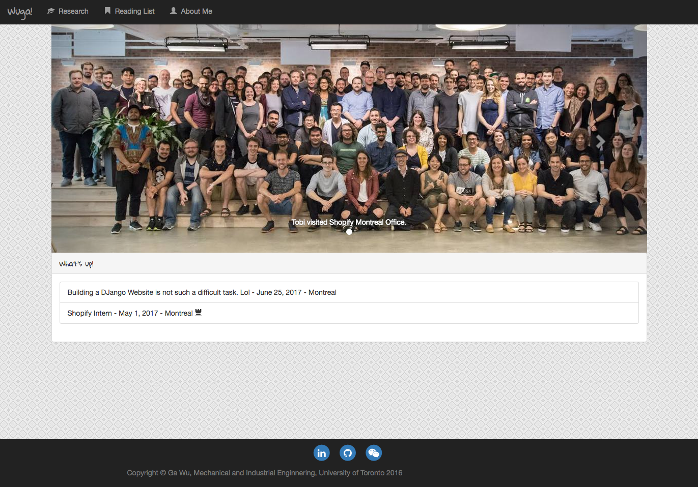
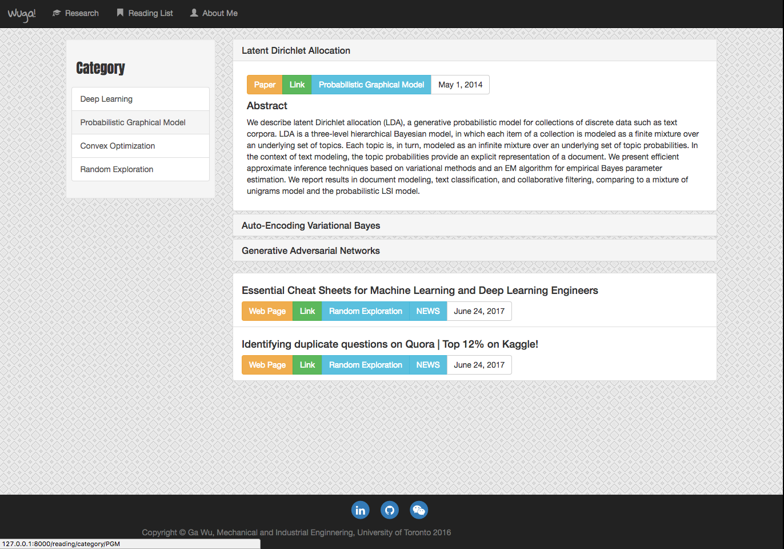
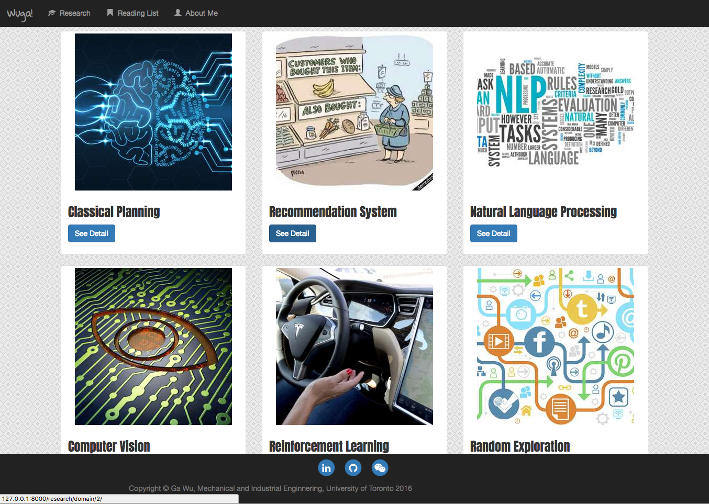
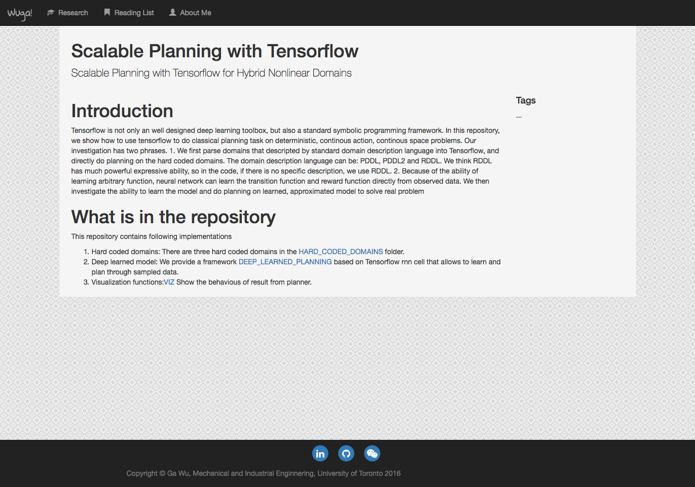
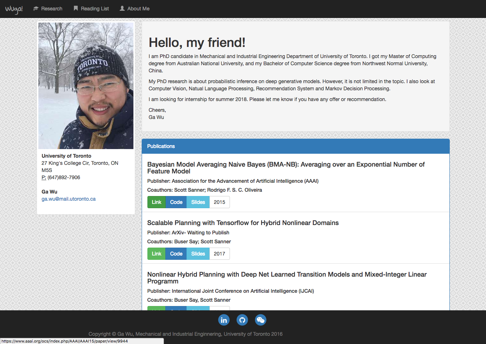

=====================
Wuga-sama Blog System
=====================

Wuga-sama blog system is a dynamic website framework that generated through Django. 

How to manage
===
Upload website to the host
if your host address is `127.0.0.1`, then you can manage the website through
`127.0.0.1/admin`

##Do not forget to create super user, How?
https://docs.djangoproject.com/en/1.11/ref/django-admin/#django-admin-createsuperuser

Download
===
Please download from branches that start with "Version". Other branches are for testing or
development.

System Requirement
===
If you just want to use this website framework, you don't need any software for this, just
upload it into your website hoster.

Screenshots
===

   

   

   

   
